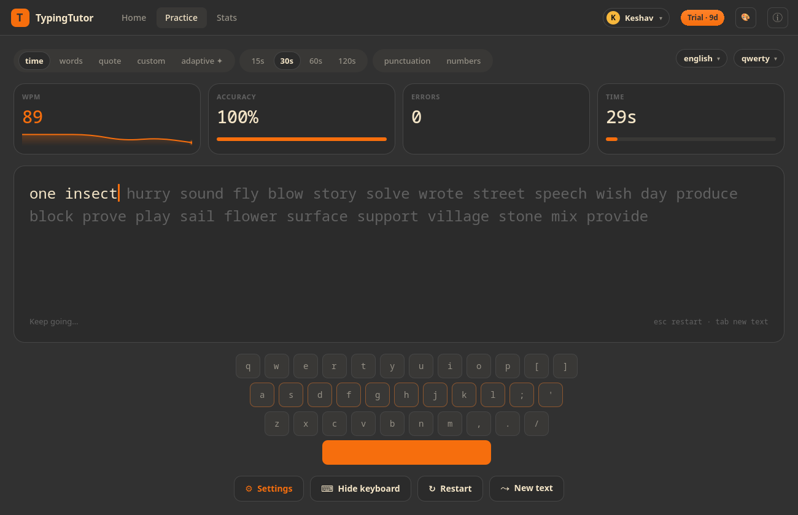
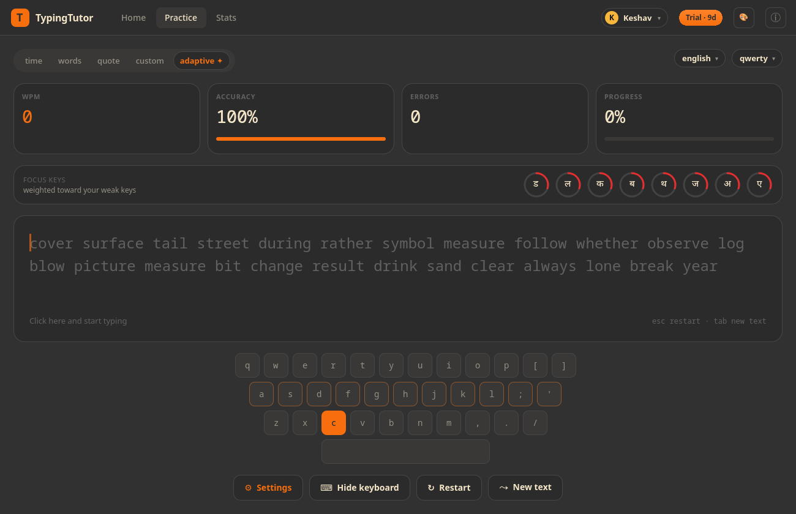
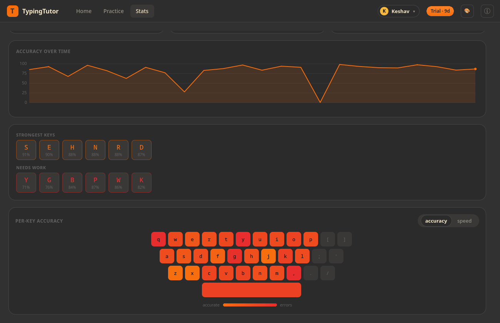
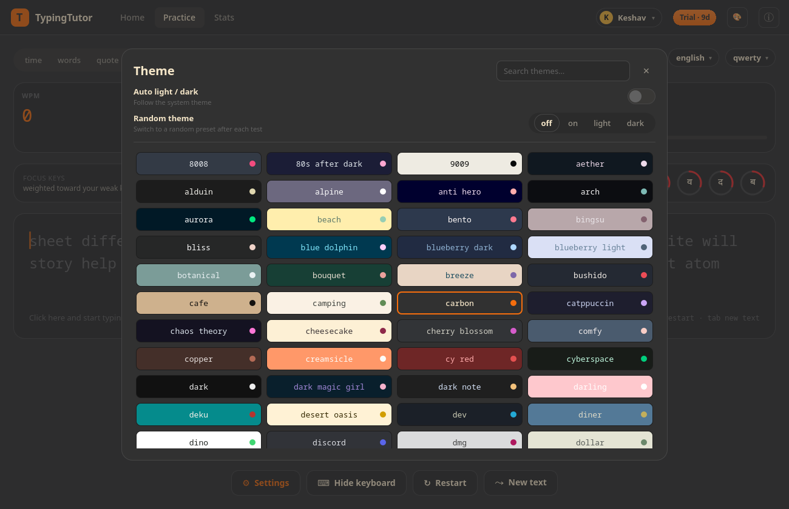
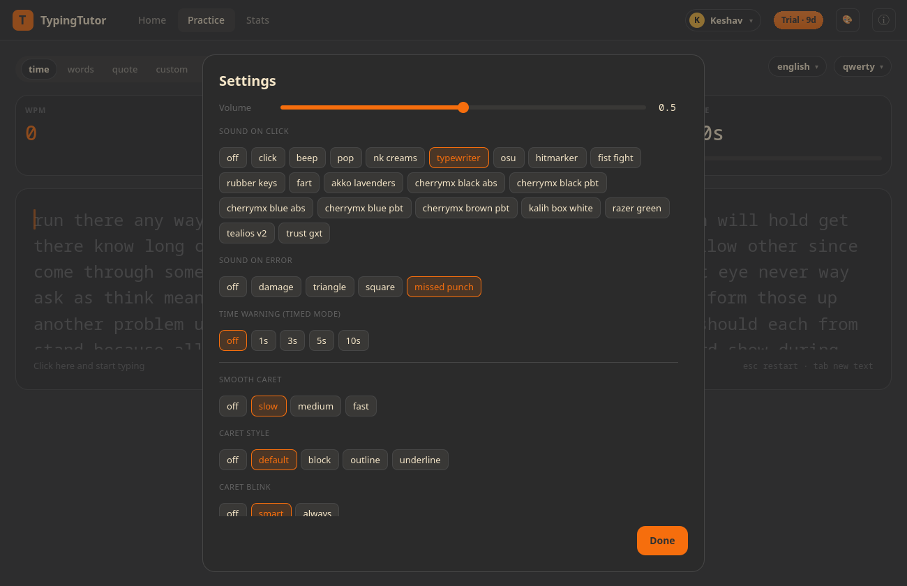

# TypingTutor: Adaptive Touch-Typing Trainer for Linux

  

TypingTutor helps you build real touch-typing speed and accuracy on your Linux
desktop. Practise with words, timed, quote and custom text across a huge range of
languages and keyboard layouts, then see exactly where your fingers slow down.

## Features

- Words, timed, quote and custom practice modes
- 265 languages and 200 keyboard layouts, including complex scripts (Hindi, Arabic and more)
- Smooth animated caret with live words-per-minute and accuracy
- Speed and accuracy history graphs to track your progress
- Per-key heatmap that highlights your weakest keys
- Crisp, low-latency key-press sounds you can turn on or off
- 187 colour themes with automatic and random switching
- Distraction-free focus mode that fades the interface while you type
- Adaptive weak-key drills, multiple user profiles and advanced analytics with CSV export (Pro)

## Screenshots

## Links

- Product page: https://ktechpit.com/USS/public/product.php?slug=typingtutor
- More apps by KTechpit: https://ktechpit.com/USS/public/products.php

## About this repository

This repository hosts packaging metadata and store assets (icons, screenshots and
the featured banner) for **TypingTutor**, a proprietary application by KTechpit.
See [LICENSE](LICENSE).
